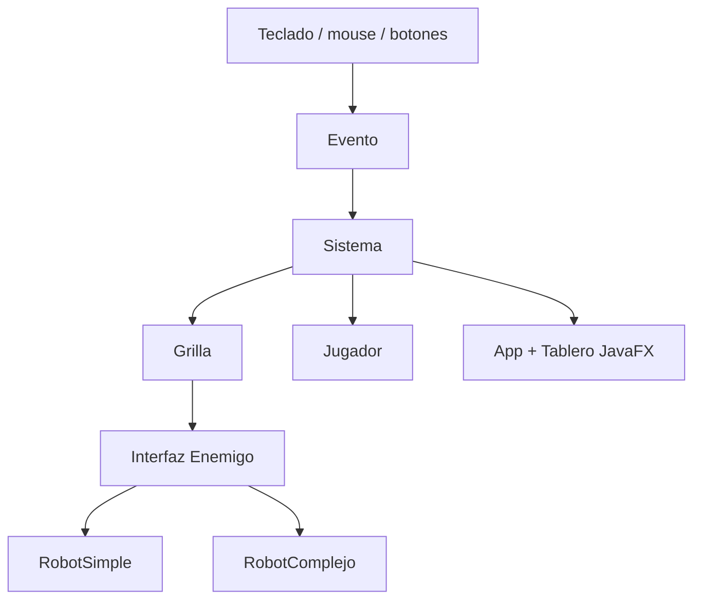
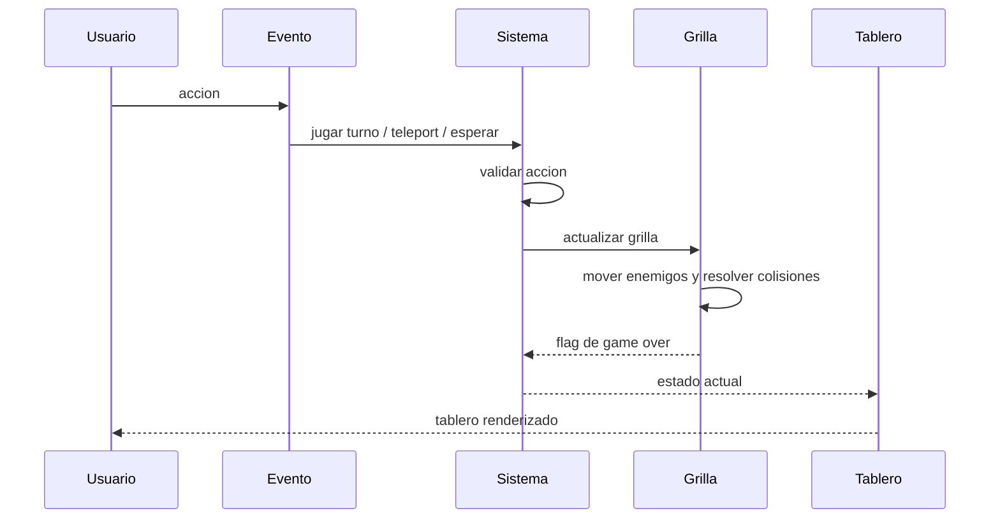

<p align="right">
  <a href="README.md">🇺🇸 English</a> | <strong>🇦🇷 Español</strong>
</p>

# Robots in Java — Juego de estrategia por turnos con JavaFX

<div align="center">


</div>

---

Una implementacion en Java del clasico juego de estrategia por turnos **Robots / Chase**, construida con JavaFX y Maven. El proyecto separa las reglas del juego de la capa visual y modela enemigos, movimiento del jugador, colisiones, puntaje, progresion de niveles y dimensiones configurables del tablero.

## Highlights

> Proyecto academico enfocado en modelado de dominio, transiciones de estado, manejo de eventos, reglas deterministicas y separacion clara entre logica de aplicacion e interfaz grafica.

- **Motor de juego por turnos**: procesa acciones del jugador, movimiento de enemigos, resolucion de colisiones, puntaje, condiciones de victoria y estados de derrota mediante un servicio central de dominio.
- **Arquitectura por capas**: mantiene la logica principal en `logica` y la presentacion/eventos de JavaFX en `interfaz`.
- **Comportamiento polimorfico de enemigos**: define un contrato comun `Enemigo` con distintas implementaciones de robots que se mueven a diferentes velocidades.
- **Modelo de grilla con estado**: almacena posiciones del jugador y enemigos en una abstraccion de tablero que se actualiza en cada turno.
- **Sistema de colisiones y puntaje**: detecta colisiones entre enemigos, marca robots destruidos como no funcionales y suma puntos.
- **Multiples formas de entrada**: soporta teclado, mouse, teletransporte aleatorio, teletransporte seguro, espera, reinicio, salida y redimensionamiento del tablero.
- **Workflow con Maven**: usa Maven para compilar y ejecutar la aplicacion JavaFX.

---

## Qué es

**Robots in Java** es un juego de escritorio desarrollado como trabajo academico en la Universidad de Buenos Aires.

El juego ubica al jugador en una grilla mientras dos tipos de robots lo persiguen por turnos. El jugador puede moverse, esperar, teletransportarse de forma aleatoria o usar un teletransporte seguro limitado. Los robots se destruyen cuando chocan entre si, y el jugador avanza al siguiente nivel cuando todos los robots funcionales fueron eliminados.

El proyecto es compacto, pero ejercita ideas utiles de ingenieria: modelado de dominio, mutacion de estado, validacion de reglas, despacho de eventos, diseno orientado a objetos y separacion entre un nucleo de aplicacion y una interfaz externa.

La calidad del codigo no es el punto principal de este repositorio. Es codigo academico de una etapa temprana, por lo que tiene asperezas, inconsistencias de nombres, pocos tests y decisiones de implementacion que hoy no repetiria. Lo mantengo publico porque muestra como estaba aprendiendo a modelar comportamiento, separar responsabilidades y razonar sobre sistemas con estado. El valor esta en la progresion y en la forma de resolver el problema, no en presentarlo como Java listo para produccion.

---

## Por qué importa

Aunque este proyecto es un juego JavaFX, el trabajo de ingenieria mas interesante esta en la **logica de aplicacion**.

Los mismos problemas aparecen en muchas aplicaciones con estado:

- modelar entidades y comportamiento
- coordinar cambios de estado desde un servicio central
- validar comandos antes de modificar estado
- mantener detalles de UI o transporte fuera del dominio
- manejar casos limite en acciones de usuario
- conservar reglas explicitas de progresion, puntaje y derrota
- dejar el codigo lo suficientemente claro para evolucionarlo

---

## Reglas del Juego

El jugador empieza en el centro del tablero. Los robots se ubican aleatoriamente y se mueven hacia el jugador luego de cada accion.

Acciones del jugador:

- Moverse una celda en cualquiera de las ocho direcciones.
- Esperar en la celda actual.
- Teletransportarse aleatoriamente a otra posicion del tablero.
- Usar un teletransporte seguro seleccionando una celda de destino.
- Redimensionar el tablero y reiniciar la partida.

Comportamiento de enemigos:

- `RobotSimple` se mueve un paso hacia el jugador.
- `RobotComplejo` se mueve dos pasos hacia el jugador.
- Los robots no funcionales quedan en su posicion y representan robots destruidos.

Progresion y derrota:

- Si un robot alcanza la posicion del jugador, la partida termina.
- Si dos robots terminan en la misma posicion, ambos se destruyen.
- Cada robot destruido por colision suma puntos al score.
- Si todos los robots son destruidos, el juego avanza al siguiente nivel.
- Los teletransportes seguros aumentan cuando el jugador avanza de nivel.

---

## Arquitectura

El codigo esta separado en dos paquetes principales:

- `logica`: dominio del juego, reglas, entidades, estado del tablero, progresion de nivel y puntaje.
- `interfaz`: aplicacion JavaFX, renderizado, botones, popups, teclado y mouse.



### Capa de Dominio

La capa de dominio vive en `src/main/java/logica`.

Responsabilidades principales:

- crear enemigos segun el nivel actual
- mantener score y contador de teletransportes seguros
- validar movimiento del jugador contra los limites del tablero
- actualizar posiciones de enemigos despues de cada turno
- detectar colisiones
- decidir si el jugador gano o perdio
- exponer el estado actual para renderizado

Clases importantes:

- `Sistema`: coordinador principal del juego. Posee score, nivel, dimensiones, jugador, grilla y cantidad de teletransportes seguros.
- `Grilla`: modelo del tablero. Guarda la posicion del jugador y un mapa de enemigos con sus posiciones.
- `Jugador`: entidad del jugador. Se mueve un paso hacia una coordenada objetivo.
- `Enemigo`: interfaz para movimiento y estado funcional de enemigos.
- `RobotSimple`: enemigo que avanza un paso hacia el jugador.
- `RobotComplejo`: enemigo que avanza dos pasos hacia el jugador.

### Capa de Presentacion

La capa de presentacion vive en `src/main/java/interfaz`.

Responsabilidades principales:

- inicializar la ventana JavaFX
- renderizar tablero y sprites sobre un canvas
- conectar botones, teclado y mouse con acciones del juego
- mostrar popups de redimensionamiento y game over
- reiniciar o cerrar la aplicacion

Clases importantes:

- `App`: punto de entrada JavaFX y ciclo principal de la pantalla.
- `Evento`: traduce eventos del usuario a llamadas al sistema del juego.
- `Tablero`: dibuja tablero, jugador, robots y celdas de colision.
- `Setup`: crea componentes reutilizables de UI y popups.
- `Boton`: pequeno wrapper sobre `Button` de JavaFX.
- `SystemInfo`: clase utilitaria incluida en el paquete de interfaz.

---

## Flujo Principal

Cada turno sigue esta secuencia:

1. El usuario ejecuta una accion mediante teclado, mouse o boton.
2. `Evento` traduce esa entrada a un comando de dominio.
3. `Sistema` valida la accion y mueve al jugador.
4. `Grilla` mueve cada enemigo funcional hacia el jugador.
5. Se resuelven colisiones y se actualiza el puntaje.
6. `Sistema` expone el nuevo estado.
7. `Tablero` redibuja el canvas de JavaFX.
8. `App` evalua condiciones de victoria y game over.



---

## Complejidad Tecnica

- Proyecto Java 22 configurado con Maven.
- Ciclo de vida de aplicacion JavaFX y manejo de escenas.
- Renderizado de tablero basado en Canvas.
- Eventos de teclado, mouse y botones.
- Modelo de dominio orientado a objetos con comportamiento polimorfico de enemigos.
- Maquina de estados por turnos con transiciones explicitas.
- Posicionamiento aleatorio de enemigos y mecanica de teletransporte.
- Deteccion de colisiones usando mapas de coordenadas.
- Progresion de score, nivel y teletransportes seguros.
- Redimensionamiento de tablero en runtime con validacion.
- Separacion clara entre logica del juego y renderizado.

---

## Estructura del Proyecto

```text
.
├── README.md
├── README.es.md
├── LICENSE
├── pom.xml
├── doc/
│   ├── TP1 DIAGRAMA FLUJO.pdf
│   └── TP1 DIAGRAMA.pdf
└── src/
    └── main/
        ├── java/
        │   ├── module-info.java
        │   ├── interfaz/
        │   │   ├── App.java
        │   │   ├── Boton.java
        │   │   ├── Evento.java
        │   │   ├── Setup.java
        │   │   ├── SystemInfo.java
        │   │   └── Tablero.java
        │   └── logica/
        │       ├── Enemigo.java
        │       ├── Grilla.java
        │       ├── Jugador.java
        │       ├── RobotComplejo.java
        │       ├── RobotSimple.java
        │       └── Sistema.java
        └── resources/
            ├── fuego.png
            ├── rayman.png
            ├── rotom.png
            └── sans.png
```

---

## Inicio Rapido

### Requisitos

- Java JDK 22
- Maven 3.8+
- Un entorno de escritorio capaz de ejecutar aplicaciones JavaFX

### Compilar

```bash
mvn compile
```

### Ejecutar

```bash
mvn javafx:run
```

### Empaquetar

```bash
mvn package
```

---

## Controles

Teclado:

```text
Q  W  E     Mover arriba-izquierda, arriba, arriba-derecha
A  S  D     Mover izquierda, esperar, derecha
Z  X  C     Mover abajo-izquierda, abajo, abajo-derecha

O           Teletransporte aleatorio
P           Activar teletransporte seguro y luego hacer click en destino
T           Redimensionar tablero
```

Mouse:

- Hacer click en una celda del tablero para moverse hacia esa posicion.
- Luego de activar el teletransporte seguro, hacer click en la celda destino.

Botones:

- `Teleport Randomly`
- `Teleport Safely`
- `Wait`
- `Dimension`

---

## Limitaciones Actuales

Este proyecto fue construido como trabajo academico y se mantiene intencionalmente compacto.

- El repositorio no incluye actualmente una suite de tests automatizados.
- El estado del juego se mantiene solo en memoria.
- La ubicacion aleatoria no es configurable por semilla.
- Las celdas de colision se representan mediante enemigos no funcionales en lugar de un modelo separado de celda.
- El renderizado usa JavaFX Canvas directamente, no un motor de videojuegos dedicado.
- Algunos textos de la interfaz estan mezclados entre ingles y espanol.
- El proyecto es una aplicacion de escritorio y no fue pensado para uso en produccion.

Estas limitaciones hacen que el codigo sea mas facil de inspeccionar y aun asi muestre trabajo relevante de diseno de aplicacion y manejo de estado.

---

## Aprendizajes de Diseno

Este proyecto demuestra:

- modelado orientado a objetos
- polimorfismo basado en interfaces
- coordinacion estilo servicio mediante `Sistema`
- validacion antes de mutar estado
- traduccion de eventos a comandos
- ejecucion deterministica de reglas despues de cada accion
- separacion entre logica de dominio y detalles de presentacion
- organizacion legible de un proyecto Maven

## Estado

**Proyecto academico Java completo**. El repositorio se conserva como una demostracion compacta de Java, Maven, JavaFX, diseno orientado a objetos y logica de aplicacion con estado.

El proyecto fue desarrollado originalmente para una materia de programacion en la Universidad de Buenos Aires y se presenta como registro de aprendizaje.

---

> **Nota:** No es un juego de produccion. Es una implementacion academica pensada para demostrar fundamentos de programacion, modelado de dominio y comportamiento interactivo en Java.
