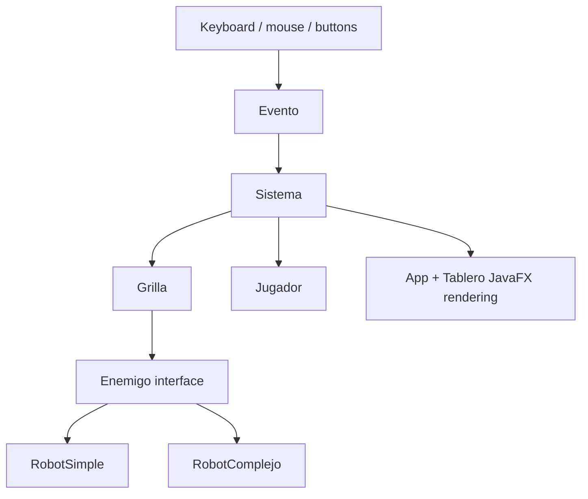
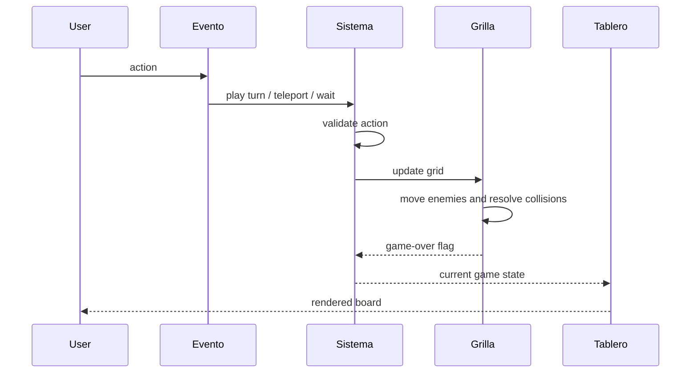

<p align="right">
  <strong>🇺🇸 English</strong> | <a href="README.es.md">🇦🇷 Español</a>
</p>

# Robots in Java — JavaFX Turn-Based Strategy Game

<div align="center">


</div>

---

A Java implementation of the classic **Robots / Chase** turn-based strategy game, built with JavaFX and Maven. The project separates game rules from the presentation layer and models enemies, player movement, collisions, scoring, level progression, and configurable board dimensions.

## Highlights

> Academic project focused on domain modeling, state transitions, event handling, deterministic rules, and clean separation between application logic and UI.

- **Turn-based game engine**: processes player actions, enemy movement, collision resolution, scoring, win conditions, and game-over states through a central domain service.
- **Layered architecture**: keeps core game logic in `logica` and JavaFX presentation/event handling in `interfaz`.
- **Polymorphic enemy behavior**: defines a shared `Enemigo` contract with different robot implementations that move at different speeds.
- **Stateful grid model**: stores player and enemy positions in a board abstraction and updates them after every turn.
- **Collision and scoring system**: detects enemy collisions, marks destroyed robots as non-functional, and awards points.
- **Multiple input paths**: supports keyboard controls, mouse-based movement, random teleport, safe teleport, wait action, restart, exit, and board resizing.
- **Maven-based workflow**: uses Maven for compilation and JavaFX execution.

---

## What It Is

**Robots in Java** is a desktop game developed for an academic programming assignment at the University of Buenos Aires.

The game places the player on a grid while two types of robots chase them each turn. The player can move, wait, teleport randomly, or use a limited safe teleport. Robots are destroyed when they collide with each other, and the player advances to the next level after all functional robots are eliminated.

The project is small, but it exercises several useful engineering ideas: domain modeling, state mutation, rule validation, event dispatching, object-oriented design, and maintaining a clear contract between an application core and an external interface.

The code quality is not the main point of this repository. This is early-days academic code, so it has rough edges, naming inconsistencies, limited tests, and implementation decisions I would not repeat today. I keep it public because it shows how I was learning to model behavior, split responsibilities, and reason about stateful systems. The value is in the progression and the underlying problem-solving, not in presenting this as production-grade Java.

---

## Why It Matters

Although this is a JavaFX game, the interesting engineering work is in the **application logic**.

The same concerns appear in many stateful applications:

- modeling entities and their behavior
- coordinating state changes through a central service
- validating commands before mutating state
- keeping UI or transport details outside the domain layer
- handling edge cases in user actions
- preserving explicit rules for progression, scoring, and failure states
- making the codebase readable enough for future changes

---

## Game Rules

The player starts at the center of the board. Robots are placed randomly and move toward the player after every action.

Player actions:

- Move one cell in any of the eight directions.
- Wait in the current cell.
- Teleport randomly to another board position.
- Use a safe teleport by selecting a destination cell.
- Resize the board and restart the match.

Enemy behavior:

- `RobotSimple` moves one step toward the player.
- `RobotComplejo` moves two steps toward the player.
- Non-functional robots stay in place and represent destroyed robots.

Progression and failure:

- If a robot reaches the player's position, the game ends.
- If two robots land on the same position, they are destroyed.
- Each robot destroyed by collision adds points to the score.
- If all robots are destroyed, the game advances to the next level.
- Safe teleports increase as the player advances through levels.

---

## Architecture

The codebase is split into two main packages:

- `logica`: game domain, rules, entities, board state, level progression, and scoring.
- `interfaz`: JavaFX application, rendering, buttons, popups, keyboard and mouse event handling.



### Domain Layer

The domain layer lives in `src/main/java/logica`.

Key responsibilities:

- create enemies according to the current level
- keep score and safe teleport counters
- validate player movement against board bounds
- update all enemy positions after each turn
- detect collisions
- decide whether the player won or lost
- expose the current state for rendering

Important classes:

- `Sistema`: main game coordinator. Owns the current score, level, board size, player, grid, and safe teleport count.
- `Grilla`: board model. Stores the player position and a map of enemies to positions.
- `Jugador`: player entity. Moves one step toward a target coordinate.
- `Enemigo`: interface for enemy movement and functional state.
- `RobotSimple`: enemy that advances one step toward the player.
- `RobotComplejo`: enemy that advances two steps toward the player.

### Presentation Layer

The presentation layer lives in `src/main/java/interfaz`.

Key responsibilities:

- initialize the JavaFX application window
- render the board and sprites on a canvas
- connect buttons, keyboard input, and mouse clicks to game actions
- show popups for board resizing and game over
- restart or exit the game

Important classes:

- `App`: JavaFX entry point and main screen lifecycle.
- `Evento`: translates user events into calls to the game system.
- `Tablero`: draws the board, player, robots, and collision cells.
- `Setup`: creates reusable UI components and popups.
- `Boton`: small wrapper around JavaFX `Button`.
- `SystemInfo`: utility class included in the interface package.

---

## Core Flow

Every turn follows the same high-level sequence:

1. The user triggers an action through keyboard, mouse, or a button.
2. `Evento` translates that input into a domain command.
3. `Sistema` validates the requested action and moves the player.
4. `Grilla` moves every functional enemy toward the player.
5. Collisions are resolved and score is updated.
6. `Sistema` exposes the new state.
7. `Tablero` redraws the JavaFX canvas.
8. `App` checks win and game-over conditions.



---

## Technical Complexity

- Java 22 project configured with Maven.
- JavaFX desktop application lifecycle and scene management.
- Canvas-based board rendering.
- Keyboard, mouse, and button event handling.
- Object-oriented domain model with polymorphic enemy behavior.
- Turn-based state machine with explicit state transitions.
- Randomized enemy placement and teleport mechanics.
- Collision detection using coordinate maps.
- Score, level, and safe-teleport progression.
- Runtime board resizing with validation.
- Clear separation between game logic and rendering concerns.

---

## Project Structure

```text
.
├── README.md
├── README.es.md
├── LICENSE
├── pom.xml
├── doc/
│   ├── TP1 DIAGRAMA FLUJO.pdf
│   └── TP1 DIAGRAMA.pdf
└── src/
    └── main/
        ├── java/
        │   ├── module-info.java
        │   ├── interfaz/
        │   │   ├── App.java
        │   │   ├── Boton.java
        │   │   ├── Evento.java
        │   │   ├── Setup.java
        │   │   ├── SystemInfo.java
        │   │   └── Tablero.java
        │   └── logica/
        │       ├── Enemigo.java
        │       ├── Grilla.java
        │       ├── Jugador.java
        │       ├── RobotComplejo.java
        │       ├── RobotSimple.java
        │       └── Sistema.java
        └── resources/
            ├── fuego.png
            ├── rayman.png
            ├── rotom.png
            └── sans.png
```

---

## Quick Start

### Requirements

- Java JDK 22
- Maven 3.8+
- A desktop environment capable of running JavaFX applications

### Build

```bash
mvn compile
```

### Run

```bash
mvn javafx:run
```

### Package

```bash
mvn package
```

---

## Controls

Keyboard:

```text
Q  W  E     Move up-left, up, up-right
A  S  D     Move left, wait, right
Z  X  C     Move down-left, down, down-right

O           Random teleport
P           Enable safe teleport, then click a target cell
T           Resize board
```

Mouse:

- Click a board cell to move toward that position.
- After enabling safe teleport, click the destination cell.

Buttons:

- `Teleport Randomly`
- `Teleport Safely`
- `Wait`
- `Dimension`

---

## Current Limitations

This project was built as an academic assignment and intentionally remains compact.

- No automated test suite is currently included in the repository.
- Game state is kept in memory only.
- Random placement is simple and not seed-configurable.
- Collision cells are represented through non-functional enemies rather than a separate cell model.
- Rendering uses direct JavaFX canvas drawing instead of a dedicated game engine.
- Some UI text is mixed between English and Spanish.
- The project is a desktop application and was not intended for production use.

These limits make the code easier to inspect while still showing meaningful application design and state-management work.

---

## Design Takeaways

This project demonstrates:

- object-oriented modeling
- interface-based polymorphism
- service-style coordination through `Sistema`
- validation before state mutation
- event-to-command translation
- deterministic rule execution after each user action
- separation between domain logic and presentation details
- readable Maven project organization

---

## Status

**Complete academic Java project**. The repository is preserved as a compact demonstration of Java, Maven, JavaFX, object-oriented design, and stateful application logic.

> **Note:** This is not a production game. It is an academic implementation designed to demonstrate programming fundamentals, domain modeling, and interactive application behavior in Java.
